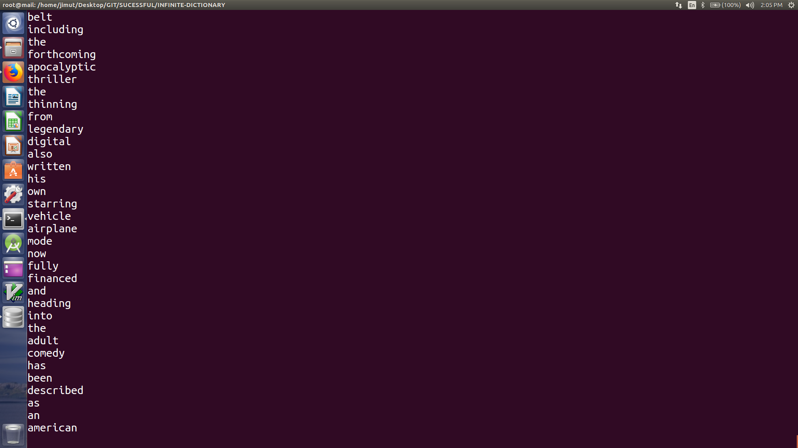
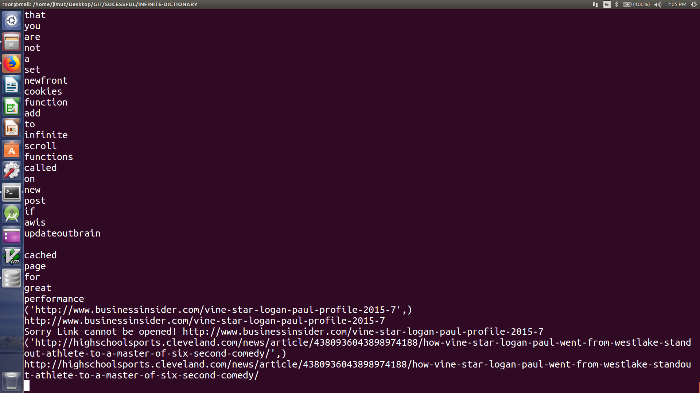
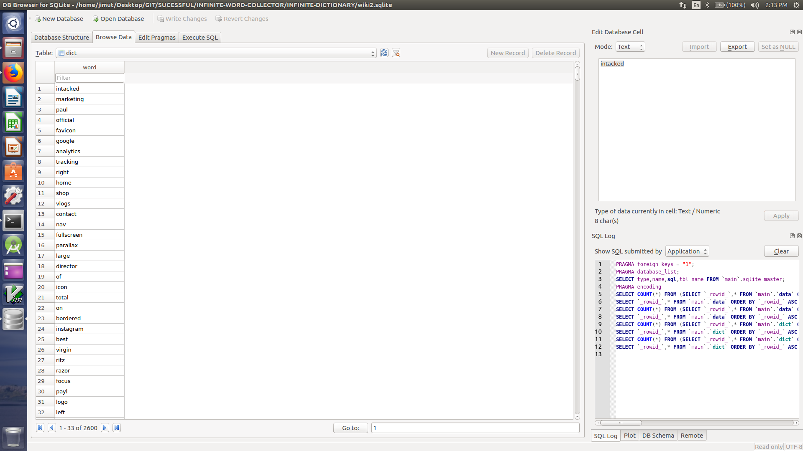

# INFINITE-WORD-COLLECTOR
This program collects the unique words by travelling all the travelled links, this is a continuation
to the [WEB-CRAWLLER](https://github.com/Jimut123/WEB-CRAWLLER) winter proj. 

## Requirements ::
```
python3
```
```
sudo apt-get install sqlite
```
```
pip install bs4
```
#### For running the program ::
```
git clone https://github.com/Jimut123/INFINITE-WORD-COLLECTOR.git

cd INFINITE-DICTIONARY

python3 dict.py


```


## A glance of the database and the data collected is given here
It collects the unique words only, since the word is set to unique key
#### Some Glances of Data Collected (travelled links)


#### Some Glances of Data Collected (travelled links)


#### The database



****
The links that are set to 1 are crawlled through this prog. It collects about 14K unique word after 
going through about 10 links. Since there is no limitation to the amount of word collected, as it is ment
for this purpose solely, this crawlls through the whole internet. I have collected about 3K word in this repo,
make sure to cross the terminal since Ctrl+C or Ctrl+D doesn't works here too. It collected Russian, Chinese, Bengali, Japnese ,Vietnamese with english words. Enjoy!!!
****


